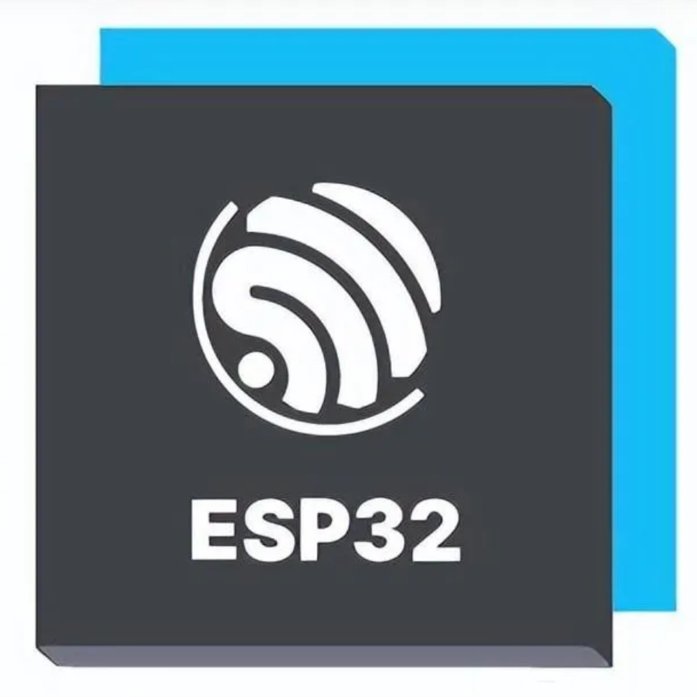
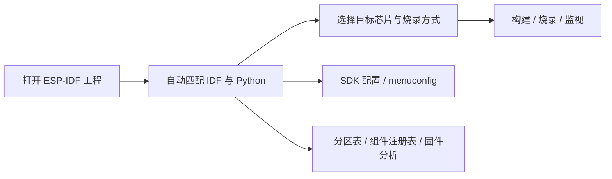

<div align="center">
  
  <h1>ESP-IDF 工具箱｜ESP-IDF Toolbox</h1>
  <p><strong>把 ESP-IDF 的工程、构建、烧录、配置与串口工作流集中到一个无需 VS Code 的 Windows 桌面应用。</strong></p>
  <p>自动识别本机 ESP-IDF 环境，支持 UART、JTAG、DFU、图形化 SDK 配置、分区表、组件注册表和多设备串口监视。</p>

  [](https://github.com/luocuiyu/ESP-IDF-Toolbox/releases/latest)
  [](https://github.com/luocuiyu/ESP-IDF-Toolbox/releases)
  [](LICENSE)
  
  

  [下载最新版](https://github.com/luocuiyu/ESP-IDF-Toolbox/releases/latest) · [查看 v0.9.0](https://github.com/luocuiyu/ESP-IDF-Toolbox/releases/tag/v0.9.0) · [提交问题](https://github.com/luocuiyu/ESP-IDF-Toolbox/issues)
</div>

> [!IMPORTANT]
> 本项目是独立社区工具，不是 Espressif 官方产品，也不代表 Espressif Systems。ESP-IDF、相关工具及部分 Webview 界面的版权归各自权利人所有。

## v0.9.0 重点更新

- 新增完整的应用内更新中心：检查、下载、后台收起、失败重试和重启安装。
- 下载时显示百分比、已下载/总大小、实时速度和预计剩余时间，并同步到 Windows 任务栏。
- 下载完成后显示系统通知；失败时可重试、打开 GitHub 手动下载或复制完整错误。
- 更新状态由 Electron 主进程维护，界面刷新或卡片收起不会丢失下载状态。
- GitHub 标签发布自动上传 `Setup.exe`、`.blockmap` 和 `latest.yml`，避免遗漏更新元数据。

## 为什么需要它？

ESP-IDF 的完整工作流通常分散在终端命令、串口工具和 VS Code 扩展页面中。工具箱将常用入口收敛到一个独立窗口：



## 功能一览

| 模块 | 能力 |
| --- | --- |
| 开发环境 | 自动读取官方安装记录、`IDF_PATH`、`IDF_TOOLS_PATH`，也可手动选择任意安装目录 |
| 工程管理 | 打开、创建、切换工程；每个工程独立保存目标芯片、端口、烧录方式和配置 |
| 构建任务 | 构建、完整清理、重新配置、停止任务、彩色错误/警告/成功日志和完成提示音 |
| 固件烧录 | UART、USB-JTAG/OpenOCD 和 DFU；支持构建、烧录、监视完整流程 |
| 串口监视 | 多端口会话、日志保留、文本/HEX 发送、波特率选择和停止后查看历史输出 |
| SDK 配置 | 图形化配置编辑器、即时依赖联动、原始键值模式和字符版 `menuconfig` |
| 工程工具 | 分区表、NVS、固件大小分析、环境诊断、OpenOCD、GDB 和 QEMU 入口 |
| 组件管理 | 浏览 ESP Component Registry，添加依赖并在应用内查看完整执行日志 |
| 多实例 | 同时打开多个工具箱窗口，分别操作不同工程和不同开发板 |
| 软件更新 | 应用内下载进度、后台状态、Windows 任务栏进度、系统通知及重启安装 |

## 下载

请前往 [Releases](https://github.com/luocuiyu/ESP-IDF-Toolbox/releases/latest) 下载：

- `Setup.exe`：推荐的 Windows 安装版，可选择安装目录，并创建桌面和开始菜单快捷方式
- `portable.exe`：无需安装的 Windows 便携单文件版（按需提供）

安装步骤：

1. 下载最新的 `ESP-IDF-Toolbox-<版本>-Setup.exe`。
2. 运行中英文安装向导并选择安装目录。
3. 安装完成后，从桌面或开始菜单启动“ESP-IDF 工具箱”。

首次升级到 v0.9.0 时请手动运行新版 Setup 覆盖安装；之后可直接从左侧“软件更新”下载并安装后续版本。工程配置和软件设置不会因覆盖升级而清除。

当前社区版本没有受信任机构签发的 Authenticode 代码签名证书，因此 Windows SmartScreen 可能显示“发布者未知”。请只从本仓库 Release 下载，并通过 Release 页面提供的 SHA-256 校验文件。

## 使用要求

- Windows 10 或 Windows 11（x64）
- 已安装可用的 ESP-IDF 环境
- 对应开发板的 USB 串口/JTAG 驱动

首次启动后选择 ESP-IDF 安装目录和工程目录。软件配置保存在自身用户配置目录，不会向工程写入工具箱专用配置文件。

### 环境与路径发现

程序不会依赖开发者电脑上的固定盘符或目录。它会依次检查：

- 官方 `~/.espressif/idf-env.json` 和 `esp_idf.json`
- 系统的 `IDF_PATH` 与 `IDF_TOOLS_PATH`
- 曾通过程序手动选择并保存的 ESP-IDF 目录
- ESP-IDF 目录的相邻父目录中可用的 `python_env`

如果源码目录和工具目录安装在不同位置，手动选择 ESP-IDF 后，程序会继续提示选择包含 `python_env` 的 `IDF_TOOLS_PATH`。切换到另一台电脑时，失效的旧工程、串口和 ESP-IDF 路径不会强行覆盖当前电脑检测到的有效环境。

当前发布的可执行文件面向 Windows 10/11 x64。“通用”指不绑定盘符、用户名、ESP-IDF 版本或安装目录，可在满足依赖的 Windows 电脑上使用；macOS/Linux 尚未提供正式安装包。

## 从源码运行

需要 Node.js 20 或更高版本。

```powershell
npm install
npm run dev
```

构建前端和 Electron 主进程：

```powershell
npm run build
```

生成 Windows x64 安装包：

```powershell
npm run dist
```

按需生成便携单文件版：

```powershell
npm run dist:portable
```

ESP-IDF 由用户单独安装，本仓库不会捆绑 ESP-IDF 工具链。

## 项目结构

- `src/`：Vue 用户界面
- `electron/`：Electron 主进程、预加载桥接和 ESP-IDF 调用
- `public/espressif/`：经独立适配的 Espressif Webview 资源
- `THIRD-PARTY-NOTICES.txt`：第三方组件和版权说明
- `LICENSES/`：第三方许可证全文

## 开源许可

本项目自行编写的代码使用 [MIT License](LICENSE)。

仓库内由 Espressif ESP-IDF VS Code 扩展改编或随附的资源继续遵循 Apache License 2.0；Codicons 等第三方内容遵循其各自许可证。详情见 [THIRD-PARTY-NOTICES.txt](THIRD-PARTY-NOTICES.txt)。MIT 许可证不会覆盖第三方材料。

## 反馈

发现问题时，请在 [GitHub Issues](https://github.com/luocuiyu/ESP-IDF-Toolbox/issues) 中附上：

- 工具箱版本
- ESP-IDF 版本和目标芯片
- 烧录方式及串口/JTAG 信息
- 去除隐私内容后的完整任务日志
